# spec2win

**Spec2Win** is an AI-powered development workflow that transforms high-level product ideas into production-ready applications deployed on Azure—using specialized GitHub Copilot agents working together.

https://github.com/user-attachments/assets/f0529e70-f437-4a14-93bc-4ab5a0450540

## 🎯 Overview

This repository provides a preconfigured development environment and agent-driven workflow that takes you from product concept to deployed application through a structured, step-by-step process.

## 🚀 Quick Start

1. **Open in Dev Container** - Everything is preconfigured in `.devcontainer/`
2. **Describe your app idea** - The more specific, the better
3. **Follow the workflow** - Use the prompts to guide specialized agents through each phase

## 🏗️ Architecture

### Development Environment

The `.devcontainer/` folder provides a **ready-to-use development container** with:
- Python 3.12


- Azure CLI & Azure Developer CLI (azd)
- TypeScript
- Docker-in-Docker
- VS Code extensions: GitHub Copilot Chat, Azure Pack, AI Studio

### MCP Servers

The `.vscode/mcp.json` configures **Model Context Protocol servers** that give agents access to:
- **context7** - Up-to-date library documentation
- **github** - Repository management and operations
- **microsoft.docs.mcp** - Official Microsoft/Azure documentation
- **playwright** - Browser automation capabilities

### AI Agents (Chat Modes)

Three specialized agents in `.github/chatmodes/`:

#### 1. **PM Agent** (`@pm`) - Product Manager
- **Model**: o3-mini
- **Tools**: Edit files, search, fetch web content
- **Purpose**: Translates ideas into structured PRDs and FRDs
- **Instructions**: Asks clarifying questions, identifies business goals, creates living documentation

#### 2. **Dev Agent** (`@dev`) - Developer
- **Model**: Claude Sonnet 4
- **Tools**: Full development suite + Context7, GitHub, Microsoft Docs, Copilot Coding Agent, AI Toolkit
- **Purpose**: Breaks down features into tasks, implements code, or delegates to GitHub Copilot
- **Instructions**: Analyzes specs, writes modular code, follows architectural patterns, creates GitHub issues

#### 3. **Azure Agent** (`@azure`) - Cloud Architect
- **Model**: Claude Sonnet 4
- **Tools**: Azure resource management, Bicep, deployment tools, infrastructure best practices
- **Purpose**: Deploys applications to Azure with IaC and CI/CD pipelines
- **Instructions**: Analyzes codebase, generates Bicep templates, creates GitHub Actions, uses Azure Dev CLI

## 📋 Workflow

```mermaid
graph TB
    Start[("👤 User<br/>High-level app description")]
    
    Start --> PRD["<b>/prd</b><br/>📝 PM Agent creates<br/>Product Requirements Document"]
    
    PRD --> FRD["<b>/frd</b><br/>📋 PM Agent breaks down<br/>Feature Requirements Documents"]
    
    FRD --> Plan["<b>/plan</b><br/>🔧 Dev Agent creates<br/>Technical Task Breakdown"]
    
    Plan --> Choice{"Implementation<br/>Choice"}
    
    Choice -->|Local| Implement["<b>/implement</b><br/>💻 Dev Agent<br/>implements code locally"]
    
    Choice -->|Delegated| Delegate["<b>/delegate</b><br/>🎯 Dev Agent creates<br/>GitHub Issue + assigns<br/>Copilot Coding Agent"]
    
    Implement --> Deploy["<b>/deploy</b><br/>☁️ Azure Agent<br/>creates IaC + deploys to Azure"]
    
    Delegate --> Deploy
    
    Deploy --> Done[("✅ Production-Ready<br/>Application on Azure")]
    
    style Start fill:#e1f5ff
    style PRD fill:#fff4e6
    style FRD fill:#fff4e6
    style Plan fill:#e8f5e9
    style Implement fill:#e8f5e9
    style Delegate fill:#e8f5e9
    style Deploy fill:#f3e5f5
    style Done fill:#e1f5ff
    style Choice fill:#fff9c4
```



### Workflow Steps

1. **`/prd`** - Product Requirements Document
   - PM Agent engages in conversation to understand the product vision
   - Creates `specs/prd.md` with goals, scope, requirements, and user stories
   - Living document that evolves with feedback

2. **`/frd`** - Feature Requirements Documents
   - PM Agent decomposes the PRD into individual features
   - Creates files in `specs/features/` for each feature
   - Defines inputs, outputs, dependencies, and acceptance criteria

3. **`/plan`** - Technical Planning
   - Dev Agent analyzes FRDs and creates technical task breakdowns
   - Creates files in `specs/tasks/` with implementation details
   - Identifies dependencies, estimates complexity, defines scaffolding needs

4. **`/implement`** OR **`/delegate`** - Implementation
   - **Option A (`/implement`)**: Dev Agent writes code directly in `src/backend` and `src/frontend`
   - **Option B (`/delegate`)**: Dev Agent creates GitHub Issues with full task descriptions and assigns to GitHub Copilot Coding Agent
   
5. **`/deploy`** - Azure Deployment
   - Azure Agent analyzes the codebase
   - Generates Bicep IaC templates
   - Creates GitHub Actions workflows for CI/CD
   - Deploys to Azure using Azure Dev CLI and MCP tools

## 📁 Documentation Structure

The workflow creates living documentation:

```
specs/
├── prd.md              # Product Requirements Document
├── features/           # Feature Requirements Documents
│   ├── feature-1.md
│   └── feature-2.md
└── tasks/              # Technical Task Specifications
    ├── task-1.md
    └── task-2.md

src/
├── backend/            # Backend implementation
└── frontend/           # Frontend implementation
```

## 🎓 Example Usage

```bash
# Start with your product idea
"I want to create a smart AI agent for elderly care that tracks vitals and alerts caregivers"

# Step 1: Create the PRD
/prd

# Step 2: Break down into features
/frd

# Step 3: Create technical plans
/plan

# Step 4a: Implement locally
/implement

# OR Step 4b: Delegate to GitHub Copilot
/delegate

# Step 5: Deploy to Azure
/deploy
```

## 🔑 Key Benefits

- **Zero Setup** - Dev container has everything preconfigured
- **Structured Process** - Clear workflow from idea to production
- **AI-Powered** - Specialized agents handle different aspects
- **Best Practices** - Built-in architectural guidance via `AGENTS.md`
- **Flexible Implementation** - Choose local development or delegation
- **Azure-Ready** - Automated IaC and CI/CD generation

## 📖 Learn More

- See `AGENTS.md` for comprehensive engineering guidelines
- Explore `.github/chatmodes/` for agent configurations
- Review `.github/prompts/` for prompt templates

## 🤝 Contributing

Contributions welcome! Extend with additional agents, prompts, or MCP servers.

---

**From idea to production in minutes, not months.** 🚀
